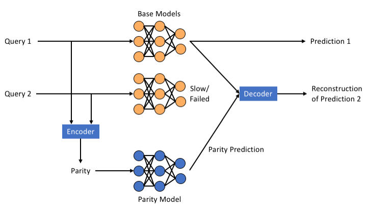

# Training parity models, encoders, and decoders
This repository contains the code used for training parity models, encoders, and
decoders for learning-based coded computation approaches.

## Background
The figure below shows an example of our target setup:


Consider two copies of a machine learning model that have been deployed for inference
on separate servers. We call these models "base models." The overall goal of performing
inference is to perform inference over copies of the base model in response to queries
in order to return predictions.

We would like this setup to be resilient to one of the servers holding a copy of the
base model experiencing slowdown or failure. In order to do so, we will add a third
model, called a "parity model," along with an encoder and a decoder. The encoder
will operate over two queries dispatched to the base models and construct a "parity query."
The parity query will be dispatched for inference over the parity model in order
to return a parity prediction. The decoder uses the parity prediction along with
the any one out of two predictions that are to be returned from the base models
in order to reconstruct the unavailable prediction. In the example above, the
prediction from the second copy of the base model is slow/failed. The decoder
uses the prediction from the first copy of the base model along with the
parity prediction in order to reconstruct the second, unavailable, prediction.

This repository contains the framework for training a parity model in order
to enable accurate reconstruction of unavailable predictions.

### General parameters
More generally, we can have `k` copies of a deployed model and we would like to
be resilient to `r` of these copies being "unavailable" (i.e., slow/failed).
The encoder `E` takes as input `k` queries and returns `r` parity queries. These
`r` parity queries are dispatched to `r` different parity models. The decoder
takes as input any `k` out of the total `(k+r)` possible base model and parity
model predictions in order to reconstruct any `r` predictions being unavailable.
This project has mostly looked into the case where `r=1`, that is, when only
one prediction is unavailable at a time.

### Training a parity model
Consider the following simple setup. Let `F` denote the base model over which
we'd like to impart resilience and `Fp` denote a parity model. Suppose we
are parameterized with `k=3`, and denote `X1`, `X2`, and `X3` as queries,
with corresponding predictions being `F(X1)`, `F(X2)`, `F(X3)`. Let the
encoder perform summation as encoding: parity `P` is constructed as
`P = X1 + X2 + X3`. Let the decoder perform subtraction in attempt to
recover an unavailable prediction: if `F(X2)` is unavailable, the decoder
will attempt to reconstruct it as `F(X2)_recon = Fp(P) - F(X1) - F(X2)`.

From the encoder and decoder described above, we can see that accurate
reconstruction `F(X2)_recon = F(X2)` can be achieved when it is the case that:
`Fp(X1 + X2 + X3) = F(X1) + F(X2) + F(X3)`. In order to train a parity model `Fp`,
we can therefore sample many different combinations of `X1`, `X2`, and `X3` from
a target dataset, compute `Fp(X1 + X2 + X3)`, and compare it to ` F(X1) + F(X2) + F(X3)`
using some distance metric as a loss function.

## This repository
### Software requirements
This repository was developed using the following versions of software and has
not been tested using other versions.
* Python 3.6.5
* PyTorch version 1.0.0 and torchvision
* CUDA 10.1, if using a GPU
* Other packages in `requirements.txt`

We strongly recommend using our provided [Dockerfile](dockerfiles/ParityModelDockerfile),
which installs all necessary prerequisites. We have tested this using Docker version 19.03.1.
To build the image associated with this Dockerfile, run:
```bash
cd dockerfiles
docker build -t parity-models-pytorch -f ParityModelDockerfile .
```

If you would like to train on a GPU using the provided docker container, then
you will need to install [nvidia-docker2](https://github.com/NVIDIA/nvidia-docker).

### Repository structure
* [base_models](base_models): Implementations of different 
* [base_model_trained_files](base_model_trained_files): PyTorch model state dictionaries containing
  trained parameters for the base models.
* [coders](coders): Implementations of simple encoding and decoding functions.
* [config](config): Configurations for training using the datasets shown in evaluation.
* [cub-localization](cub-localization): Instructions for training a parity
model for localization tasks.
* [data](data): Directory to which datasets will be downloaded.
* [datasets](datasets): PyTorch `Dataset` implementations for generating samples for training
  the encoding and decoding functions.
* [loss](loss): PyTorch loss function modifications used for learning encoders and decoders.
* [util](util): Utility methods used throughout the repository.
* [parity_model_trainer.py](parity_model_trainer.py): Top-level class for training a parity model.
* [train_config.py](train_config.py): Script to configure and launch a training run.

## Running a training job
We first describe how to run a simple training experiment and then provide
details for performing all training runs found in evaluation.

### Setup
We suggest using our provided [Dockerfile](./dockerfiles/ParityModelDockerfile),
which installs all necessary prerequisites. We have tested this using Docker version 19.03.1.
To build the image associated with this Dockerfile, run:
```bash
cd dockerfiles
docker build -t parity-models-pytorch -f ParityModelDockerfile .
```
If you would like to train on a GPU using the provided docker container, then
you will need to install [nvidia-docker2](https://github.com/NVIDIA/nvidia-docker).

### MNIST Example
This example trains an MLP parity model for 10 epochs using the MNIST dataset.
This should take less than 5 minutes on a laptop.

1. Ensure that you have built the `parity-models-pytorch` Docker image.
2. Start the Docker container, and attach the `parity-models` volume. **NOTE:** If you want your container to have access to a GPU, then you must substitute the `docker` command below for `nvidia-docker`. (make sure `nvidia-docker` and `CUDA` are installed to use the GPU)
```bash
docker run -it --rm -v /path/to/parity-models:/workspace/parity-models parity-models-pytorch:latest
```
3. Start training the MNIST parity model:
```bash
# These commands should be run from within the Docker container
cd /workspace/parity-models/train
python3 train_config.py config/mnist.json save
```

**What output should you see?**
Provided all has gone well, you should see the following output appear:
```
mnist base-mlp 2 mse coders.summation.AdditionEncoder coders.summation.SubtractionDecoder
Base model train accuracy is 59754 / 60000 = 0.9959
Base model test accuracy is 9793 / 10000 = 0.9793
Epoch 0. train. Top-1=0.1634, Top-5=0.6181, Loss=163.7766: 100%|###############################################################################| 430/430 [00:02<00:00, 196.08it/s]
Epoch 0. val. Top-1=0.2862, Top-5=0.7554, Loss=116.5788: 100%|###################################################################################| 40/40 [00:00<00:00, 315.57it/s]
Epoch 1. train. Top-1=0.4334, Top-5=0.8611, Loss=82.6607: 100%|################################################################################| 430/430 [00:02<00:00, 183.46it/s]
Epoch 1. val. Top-1=0.5138, Top-5=0.9122, Loss=66.1130: 100%|####################################################################################| 40/40 [00:00<00:00, 315.98it/s]
Epoch 2. train. Top-1=0.5585, Top-5=0.9221, Loss=62.2081:  36%|############################6                                                   | 154/430 [00:00<00:01, 195.82it/s
```
Let's walk through these step-by-step:
* `mnist base-mlp 2 mse add sub`: This line prints information about the
   configuration currently being trained. In this case, this indicates that
   we are training with the MNIST dataset using an MLP model, with k=2,
   using mean-squared-error as loss, using the addition encoder and subtraction
   decoder.
* `Base model train accuracy is 59754 / 60000 = 0.9959`: These lines show the
   accuracy of the base model (`F` in [Background](#Background)) on the
   training and test datasets.
* `Epoch 0. train. ...`: When these lines run, we're actually training! For
   each epoch, we print the current progress, top-1 and top-5 accuracies,
   and current average loss. We print these for both training and validation
   sets. Accuracy on the test dataset is calculated, but not printed to the
   user.

At the end of each epoch, the current results (e.g., loss, accuracy) are saved
to files under the `save` directory (or whichever directory you passed in to
the training command above). Results will be placed in a directory indexed
by the configuration of our run. In the example above, this will be in:
```
save/mnist/base-mlp/k2/mse/coders.summation.AdditionEncoder/coders.summation.SubtractionDecoder/
```

This directory contains a number of files:
* `current.pth`: Saved model and optimizer parameters from the last epoch to
complete
* `best.pth`: Saved model and optimizer parameters from the epoch which
resulted in the highest accuracy on the validation dataset.
* `{train,val,test}_overall_{top1,top2,top5,top10,top20}`: The accuracy on the
`{train,val,test}` datasets obtained by comparing the result of the decoder to
the true label from the dataset. Each line represents the result from an epoch.
* `{train,val,test}_reconstruction_{top1,top2,top5,top10,top20}`: The accuracy on the
`{train,val,test}` datasets obtained by comparing the result of the decoder to
the result that would be returned by the base model (`F`).
 Each line represents the result from an epoch.

The files in this directory enable one to continue training from a checkpoint.
Using the example above, we can continue training from the last epoch of our
previous run with:
```bash
python3 train_config.py config/your_config.json save --continue_from_file save/mnist/base-mlp/k2/mse/coders.summation.AdditionEncoder/coders.summation.SubtractionDecoder/current.pth
```
Please make sure the configuration at `config/your_config.json` matches that of the checkpoint file.

To run just the test one can use the `--only_test` flag to the above command(s).

#### Using other datasets and base models
Due to the size of the datasets and model files used in our evaluation, we are
unable to keep all datasets and models on Github. All model files that are less
than 100 MB in size are available directly in this repository. We have hosted
the remaining datasets and model files in a public AWS S3 bucket. Please
follow the commands below to access these. Please raise an issue if you are
unable to access AWS, and we will work out a way to provide you with the
files that you need.

**Download the datasets used in our evaluation:**
```bash
./download_data.sh
```
This will download the Google Commands and Cat v. Dog datasets. Remaining
datasets are handled by PyTorch and downloaded as necessary.

**Download trained base models**

Download the trained base model weights used in training a parity model. Some
of these weights are already located in [base_model_trained_files](base_model_trained_files).
Others (those too large to be checked-in with Github) may be downloaded with:
```
./download_base_models.sh
```

## Modifying this repository
Want to explore adding a new encoder, decoder, base model, dataset, etc.?
If so, check out the links below and raise an issue if you find the framework
poorly suited for your desired change!

### Adding a new base model
See details in the [base_models](base_models) directory regarding
adding a base model that is not included in this repository.

### Adding a new dataset
See the patterns used for constructing datasets in the [datasets](datasets) directory.

### Adding new encoders/decoders
See details in the [coders](coders) directory regarding adding a new
encoder/decoder architecture.
